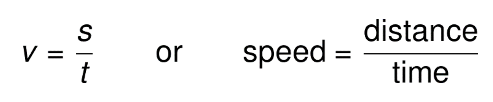
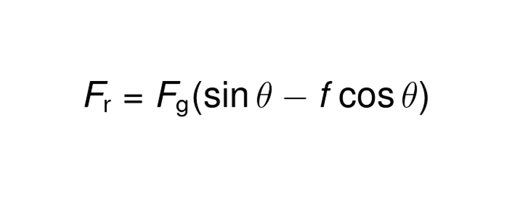
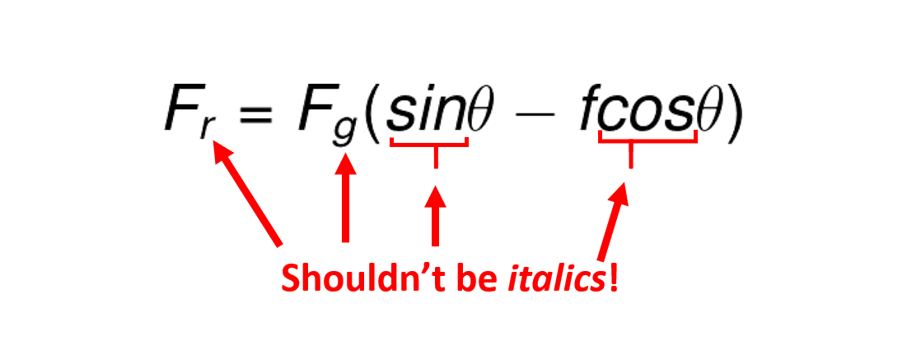
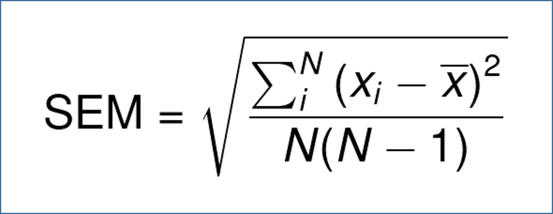
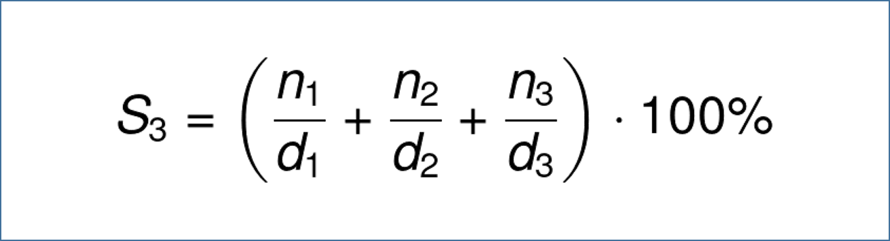

2.3 Custom JS
==================================

We have a full separate part of the documentation dedicated to things you can do with custom JS. This section deals with two things only: keeping our style uniform. 

2.3.1 Adding an equation above the calculator: style guide
-----------------------------
Whenever you want to create an equation above calculator fields, you should follow these steps:

* Go to https://www.codecogs.com/latex/eqneditor.php

* You can choose any image format, but the preferable ones are **.gif** or **.png** as they have a transparent background. **DON'T use .svg** unless you really need to - sometimes there are problems, e.g. with subscripts/superscripts for IE or some mobile browsers.

* Use **Helvetica** font and the greatest resolution possible (300) as these images are usually pretty light (<100 kB). The size doesn't really matter as you can adjust it within `` inside the calc.

* All the symbols should be written with *italics*, whereas **all the other things** like digits, functions names (sin, cos, log, etc.), full words (as well as acronyms) **should not**.  *A note for subscripts/superscripts* - if they refer to variables, they should be italicized, but if they are abbreviations (like ``F_g`` for *gravitational* force) - they shouldn't.
By default, symbols are already slanted, and digits are not, as are functions (you should pick one from the list at the top or type ``\sin{}``, ``\log{}``, etc.), so you should take care only of subscripts/superscripts (like in ``F_g``) and full words using ``\mathrm{}``, e.g., ``F_\mathrm{g}`` or ``\mathrm{yield}``. For more details, see some examples below.

* In general, you don't need to write any multiplication sign, but if you really want to (or it's a good idea to show multiplication explicitly), **use a dot ``·`` **(``\cdot``). See an example below.

* You can always deviate from these suggestions as long as you have a good reason, e.g. when we have comments that people don't understand what is what, or how to use the calculator. In such cases, we may try to find out if a change helps or not.

Remember, treat this list of steps as **a recommendation, not a requirement**. :wink: Although we probably use the equations mostly for maths, physics, chemistry, they can appear also elsewhere.

You are still allowed to use different tools for equations, e.g. mathcha, as long as the final result will be consistent with our standard.

Examples
++++++++++++++++++

* Symbolic notation vs. full variable names

 
(*Source code* ``v=\frac{s}{t}``, ``\mathrm{speed} = \frac{\mathrm{distance}}{\mathrm{time}}``).

* Correct vs. incorrect use of italics: 

See that the subscripts refer to full words (r->resulting, g->gravitational) so they shouldn't be italicized.
(*Source code correct* ``F_\mathrm{r} = F_\mathrm{g}(\sin{\theta} - f\cos{\theta})``,
*Source code incorrect* ``F_r = F_g(sin{\theta} - fcos{\theta})``).

* Use of italics - acronyms and subscripts:

See that the subscripts refer to variables (``i``, ``N``), so they should be *italicized*.
(*Source code* ``\mathrm{SEM} = \sqrt{\frac{\sum_i^N\left(x_i - \overline{x}\right)^2}{N(N-1)}}``).

* Use of the multiplication dot ``·``: 

(*Source code* ``S_3 = \left(\frac{n_1}{d_1} + \frac{n_2}{d_2} + \frac{n_3}{d_3}\right) \cdot 100\%``).

2.3.2 Internal anchors
-------------------------------

You can create links leading from the calculator box to the text, allowing the user to quickly jump between the two parts. Here are some tipis you need to remember.

* Make sure to use the full URL every time (that is, use the URL www.omnicalculator.com/health/my-calculator#section-name instead of just #section-name). This will ensure the embeds work correctly.

* Use the proper URL of a published calculator - that is, with a category name in the URL and not the /all category.

* If you’re using such anchors, make sure to include the following piece of code:

::

  var targetStr = '';
  if (ctx.runningOn("embed")) {
  targetStr = 'target="_blank" ';
  }

And use the following for internal anchors:
::

<a ' + targetStr + 'href="https://www.omnicalculator.com/category/slug">anchor text</a>

* Consider adding a *Back to calculator* link from the text to ensure easy navigation for mobile users. 
