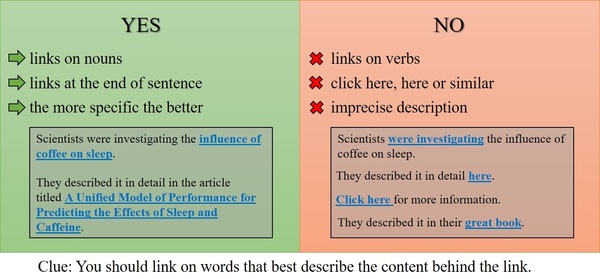

3.2 How to use markdown: basics
=========================

We're using `markdown <https://commonmark.org/help/>`_ with a few custom html tags (more on them later). Take a look at the link... it's a 60-seconds lesson. Also, they have a 10-minute-long tutorial. 

Tags that we use:

* "##" This is a level-2 header, we use them for... headers :-). Simply use two "hash" characters and a space followed by header's text.

* To create a bullet list, start your line with an asterisk followed by a space and some text, like this: "* this is an item". Each item in a new line.

* To create a numbered list, start your line with a number, then a period, then space, then text, like this: "1. this is an item {new line} 1. this is a 2nd item {new line} 1. this is a third item".

* 'alpha = beta + gamma' This will create a nicely formatted block, use it for numbers and equations. It will look like this: `alpha = beta + gamma`. You can also use the <code></code> tag instead. 

* To make external links, use [anchor text](URL address). Remember about a good anchor text!

